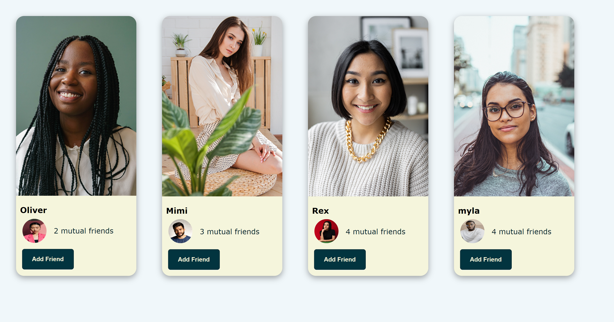

# card-element
Got inspired to do card element similar like facebook add-friends by building realistic projects. 

## Table of contents

- [card-element](#card-element)
  - [Table of contents](#table-of-contents)
  - [Overview](#overview)
    - [Screenshot](#screenshot)
    - [Links](#links)
  - [My process](#my-process)
    - [Built with](#built-with)
    - [What I learned](#what-i-learned)
    - [Continued development](#continued-development)
    - [Useful resources](#useful-resources)
  - [Author](#author)
  - [Acknowledgments](#acknowledgments)


## Overview

### Screenshot





### Links

- Solution URL: (https://github.com/lidma/Qr-code-component-elementor-challenge/tree/main/QR%20CODE)
- Live Site URL: (https://github.com/lidma/Qr-code-component-elementor-challenge/tree/main/QR%20CODE)
- 
## My process

### Built with

- Semantic HTML5 markup
- CSS custom properties
- Flexbox


### What I learned

for me it was difficult to align the the children in their parent container, i used flexbox so that the should have proportion size, and also for it the wrap and overall reponsive

At the end, i believe i did a good job with the things that i used.
Always open to any comments


```css
.profile {
    max-width: 660px;
    /* width: 100%; */
    margin: 2em;
    /* border: 2px solid lightblue; */
    border-radius: 20px;
    background-color: beige;
    /* box-shadow: 0px 10px 15px -3px rgba(143, 167, 229, 0.1); */
    box-shadow: rgba(0, 0, 0, 0.35) 0px 5px 15px;
    border-radius: 20px 20px 20px 20px;
}
.profile-picture {
    border-radius: 20px 20px 0px 0px;

}
.container {
    display: flex;
    flex-wrap: wrap;
}
.mutual-friends-row {
    display: flex;
    flex-direction: row;
    margin: 0 1em;
    color: #04232a;
    
}

```

### Continued development

I would like to make my own website using flexbox so this helps me exercise.

with this method i believe that it would be easy to implement.

### Useful resources

- [FLEXBOX FROGGY](https://flexboxfroggy.com/#es) - This helped me to understand better how to use flexbox.


## Author

-  [@lidma](https://www.frontendmentor.io/profile/lidma)


## Acknowledgments


At some point i was a little stuck with setting the style for the image. And i found this video helpful.

(https://www.youtube.com/watch?v=JFyMWwOxHYM&t=865s)
